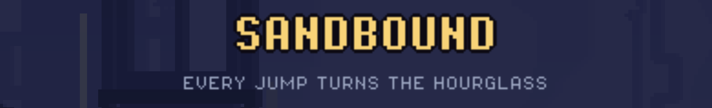

# Sandbound

A platformer where the player **is** an hourglass. The sand drains
continuously; at zero, you die. Every jump does three things at once:

1. **Flips the hourglass** — `sand` becomes `SAND_MAX - sand`, so the drained
   sand comes back. Flip while nearly empty and you refill; flip while full and
   you are left with almost nothing.
2. **Swaps plane** — a level exists as two (or up to four) superimposed
   versions with different platforms and monsters, and the jump teleports you
   between them at the same `(x, y)`.
3. **Launches you** — an ordinary upward impulse.

So **you can only refuel by net-changing plane**. A **spring** throws you with
no flip, and a **flip-pad** flips the sand with no jump and no plane change.

## Running

```bash
godot --path .
```

`←`/`→` or `A`/`D` move, `Space`/`W`/`↑` jump, `R` restarts, `Esc` returns to
the menu, `Alt+Enter` (or `F11`) leaves fullscreen.

It launches fullscreen at a 960×540 design resolution — every level coordinate
is in those units — letterboxed to fit, so a level frames identically on every
display.

## Working on it

- **Levels** are in `scenes/levels/`. The folder is scanned at startup, so a new
  `.tscn` needs no wiring: play order and the title shown in the menu and HUD
  both come from the filename (`level_04_the_spring.tscn` → "The Spring").
- **Entities** to drop into a level are in `scenes/entities/`.
- **Every tunable number** is in `resources/game_config.tres`, defined by
  [`scripts/game_config.gd`](scripts/game_config.gd).
- **Tests** cover the maths and nothing else. They run headless:
  `godot --headless --path . tests/sand_test.tscn`

[docs/LEVELS.md](docs/LEVELS.md) is the level-authoring reference: the entity
table, the rules a level may bend, and how to tune.
[docs/DESIGN.md](docs/DESIGN.md) explains why the sand, the planes, the gravity
and the light behave the way they do.
[AGENTS.md](AGENTS.md) has the workflow for building a feature.

## Contributors

Sandbound was built by:

- [@Athryell](https://github.com/Athryell)
- [@pierclgr](https://github.com/pierclgr)
- [@Letju](https://github.com/Letju)

## Screenshots


*"Downside Up" — a gravity pad has turned the world over, so the glass falls
upward. The gauge top-left is the same hourglass you are playing.*


*"Crossfire" — cannons hold the line they aimed on, so the brick block is real
cover. The dashed cyan slab is solid in the plane the next jump lands in, not in
this one.*
