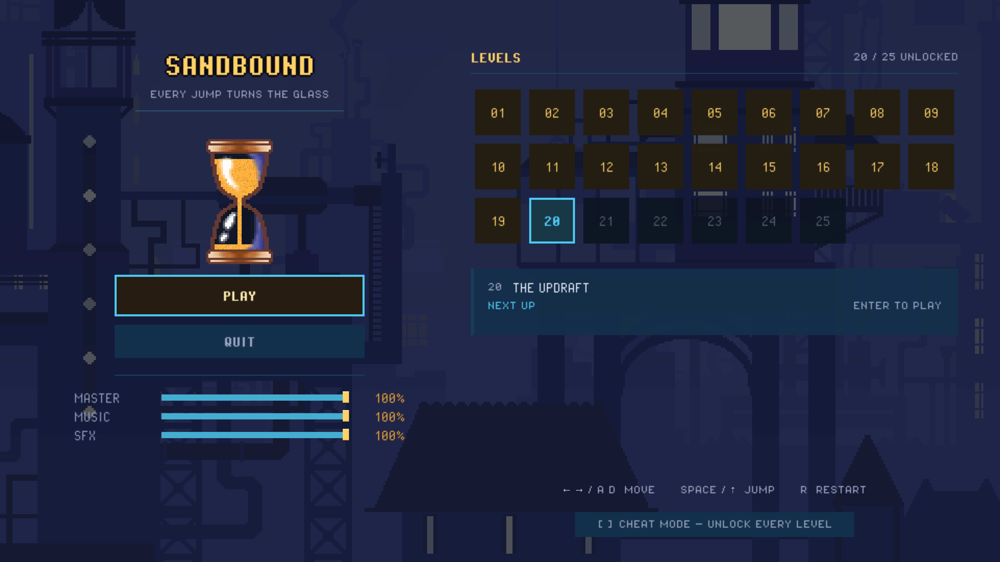

# Menu UI — design

Design for the rework of `scenes/ui/main_menu.tscn`. Written before any code, so
the layout and the palette can be argued with while they are still cheap to
change.

## 1. What the project already has

### Art

| Asset | Size | Notes |
|---|---|---|
| `art/bg/background 1..4/` | 576×324 per layer | Pixel-art steampunk skylines. `1.png` is the sky, `2..N` run far to near. `orig*.png` are reference composites, not layers. |
| `art/sprites/hourglass.png` | 32×64 | Frame only — the cavity is transparent and the sand is drawn behind it. Trim is 32×60. |
| `art/sprites/clock.png` | 32×32 | A clock/gear face. Currently unused by any scene. |
| `art/sprites/dimensional_portal.png` | 96×64 | Greyscale, tinted at runtime. |
| `art/sprites/bricks_1.png` | 64×64 | Greyscale, tinted per theme by `Palette.bricks`. |
| `feather` `spike` `cannon_*` | 16–24 px | Gameplay props. |

The four backgrounds are the strongest assets in the repo and the menu uses
none of them.

Shared sprite ink is `#663931`; the backgrounds are tiny palettes — 11, 9, 14
and 23 colours — so anything drawn over them must be flat, hard-edged and
un-gradiented or it reads as a different game.

### Colour

`scripts/entities/palette.gd` is authoritative and states its own budget: *four
hue families and no fifth.* Plane hue for the world, **warm gold for time**,
magenta-red for danger, mint for the spring.

| Role | Constant | Hex |
|---|---|---|
| Identity / plane 0 | `PLANE_SOLIDS[0]` | `#4cc9f0` |
| Time | `SAND_FULL` / `DOOR` | `#ffb03a` / `#ffd166` |
| Danger | `SAND_LOW` / `MONSTER` | `#ff4d6d` |
| Glass / bright text | `GLASS` | `#eef2ff` |
| Dim text | `TEXT_DIM` | `#9aa6c4` |
| Room, plane 0 | `PLANE_ROOMS[0]` | `#102941` `#050c15` `#14304a` `#1b3e5c` |
| Level ink | `Outline.INK` | `#0d0a14` |
| Window clear | `project.godot` | `#0c1a2b` |

**The menu background is already decided by this file.** `INVERSION_TINTS`
records that the skies of themes 1, 2 and 4 average hue 25–30 at luminance ~0.7
— "hot and bright, where gold cannot be seen at all" — and that theme 3, the
blue-violet night, is "the one sky the gold of time survives". A menu whose
title is the colour of time therefore belongs on **background 3**. Its art also
already contains warm lit windows (`#d4cdaf`, `#7e7554`), so gold is native to
that picture rather than pasted onto it.

### Code worth reusing rather than rewriting

- `Backdrop` / `BackdropLayer` — loads and parallaxes a numbered background
  folder. `sync(camera_position)` takes any position, so a virtual camera can
  drive an idle pan with no gameplay attached.
- `HourglassSprite.draw(canvas, size, fills, sand, down, invert, turning)` —
  draws the glass at any size with live sand. The HUD already calls it at 32×60.
- `HourglassMotion` — the tumble and the sand's slosh. A menu-local instance
  gives an animated glass for free (do **not** borrow the `Glass` autoload; that
  one belongs to the run).
- `AudioSettings` — one slider per bus, already self-syncing. Reuse as-is.
- `Transition` — the fade veil, currently built inline in `main.tscn`.
- `Game.levels_reached` / `is_unlocked()` / `resume_index()` — enough to derive
  three level states with **no save-format change**: cleared is
  `i < levels_reached`, next is `i == levels_reached`, locked is above it.

### What is missing

1. **No font asset at all.** Every label is Godot's default sans. On a 960×540
   canvas at integer scale, next to 1-px pixel art, this is the single largest
   fidelity break in the game.
2. **No `Theme` resource.** Every colour and size is a per-node override, so
   nothing is reusable and the level buttons are unstyleable — they are built in
   code by `_build_level_buttons()` and inherit Godot's grey.

## 2. What is wrong with the current menu

`scenes/ui/main_menu.tscn` is a single centred `VBoxContainer` holding: title,
scrolling 4-column level grid, PLAY + QUIT, three volume sliders, a cheat
checkbox and a controls hint — all inside 540 px minus 56 px of padding.

1. **The art is absent.** A flat `ColorRect` at the window clear colour.
2. **It is a settings form, not a title screen.** Seven stacked groups, no
   hierarchy, nothing dominant.
3. **Default Godot theme.** Rounded grey plates and a system sans over pixel art.
4. **The identity object is missing.** The game is an hourglass; the menu shows
   a 34-px text label.
5. **It does not fit, and it will fit less.** 25 level scenes at 190×34 in 4
   columns already needs a scrollbar, and the grid is sized by whatever is in
   `scenes/levels/`, so every new level makes it worse.
6. **Locked and cleared look the same.** A locked level is Godot's `disabled`
   grey; a cleared one is indistinguishable from an untouched one.
7. **The controls hint is duplicated** — `hud.gd` owns `HINT_FULL` and shows it
   in-game, where it is actually needed.
8. **The narrow centre column wastes a 16:9 frame.** The real layout bug.

## 3. The design

### Principles

- The menu is **a room in the same city**, not a screen in front of the game.
- **One primary action.** PLAY resumes at the furthest level unlocked; the grid
  is for choosing otherwise.
- **Two columns**: identity on the left, progress on the right. Fills the frame,
  and puts everything one keypress away — no sub-screens for a jam build.
- **Nothing rounded, nothing gradiated, no new hue.** Every colour below is an
  existing `Palette` constant.

### Layout, 960×540, all values in design px

Margins: 40 left/right, 40 top, 24 bottom. Columns: left `x 40..420`
(centre 230), gutter 32, right `x 452..920`.

**Left column — identity**

| y | Element | Spec |
|---|---|---|
| 44–80 | Wordmark `SANDBOUND` | 32 px bold, tracking +3, `#ffd166`, 1 px `#0d0a14` outline + `(2,2)` shadow |
| 84–92 | Tagline `EVERY JUMP TURNS THE GLASS` | 8 px, `#9aa6c4`, tracking +1 |
| 106 | Rule, 200 wide, centred | 1 px `#4cc9f0` @ 25% |
| 132–252 | **Live hourglass**, 64×120 at (230, 192) | `HourglassSprite.draw` — the painted `hourglass.png`, sand behind its transparent cavity. Menu-local `HourglassMotion` |
| 264–304 | `PLAY` | 240×40, primary |
| 312–344 | `QUIT` | 240×32, ghost |
| 360 | Rule, 240 wide | 1 px `#1b3e5c` |
| 374–428 | Master / Music / SFX | `AudioSettings`, 3 rows, 22 px pitch |

**Right column — progress**

| y | Element | Spec |
|---|---|---|
| 46–62 | `LEVELS` | 16 px bold, tracking +2, `#ffd166` |
| 54 | `12 / 25 UNLOCKED`, right-aligned to 920 | 8 px, `#9aa6c4` |
| 70 | Rule, full width | 1 px `#1b3e5c` |
| 86+ | **Chip grid** | 44×44 chips, 9 per row, 8 px gutters, row block 460 wide at `x 456`. 25 levels = 3 rows, ending y 234 |
| 258–322 | **Detail card** | Full width, 64 tall, 3 px accent bar on the left edge in the focused chip's state colour |
| 496–506 | Cheat toggle | 8 px, `#9aa6c4` — it belongs with the locks it opens |

The glass is the **painted sprite**, never `HourglassShape`'s drawn geometry:
`HourglassSprite.draw` puts the sand in first and lays `hourglass.png` over it,
so the frame stays the pixel art the game is built from. 64×120 is exactly 2× the
art's 32×60 trim — the size must stay an integer multiple or nearest sampling
tears the 1-px frame, the same rule `Backdrop.ART_SCALE` documents for the city.

The numbered chip grid is the fix for point 5: 9 per row at 52 px pitch holds 45
levels in five rows with no scrollbar, where the current 190-px name buttons
need a scrollbar at 21. The name moves into the detail card, which shows the
focused level only.

### Chip states

Every chip gets an ink base of `#0d1420` @ 72% first, then its state tint — so
the number always sits on a calm field rather than on a truss in the artwork.
(The mockup omits the base; the chips there are visibly busier than they should
be.)

| State | Plate over base | Border | Number | Mark |
|---|---|---|---|---|
| Cleared | `#ffd166` @ 18% | 1 px `#ffd166` | `#ffd166` | 3×3 filled square, bottom-right |
| Next | `#4cc9f0` @ 20% | 2 px `#4cc9f0` | `#4cc9f0` | — |
| Unlocked | `#14304a` | 1 px `#1b3e5c` | `#eef2ff` | — |
| Locked | — | 1 px `#1b3e5c` @ 55% | `#9aa6c4` @ 35% | — |

No padlock: there is no lock glyph in `art/` and a dim number reads as closed
already.

### Buttons

`StyleBoxFlat`, **corner radius 0**, content margins 10/6.

| State | Fill | Border | Text |
|---|---|---|---|
| Normal | `#14304a` | 1 px `#1b3e5c` | `#9aa6c4` |
| Hover | `#1b3e5c` | 1 px `#4cc9f0` @ 60% | `#eef2ff` |
| Focus | `#1b3e5c` | 2 px `#4cc9f0` | `#eef2ff` |
| Pressed | `#102941` | 1 px `#4cc9f0` | `#eef2ff`, shifted down 1 px |
| Disabled | `#0d1420` @ 60% | 1 px `#1b3e5c` @ 55% | `#9aa6c4` @ 35% |
| **Primary** (PLAY) | `#ffd166` @ 16% | 1 px `#ffd166` | `#ffd166` |

Primary hover lifts the fill to 30%; primary focus takes the 2 px cyan border
over the gold one, so focus stays one colour everywhere.

### Typography

**Pixel Operator** by Jayvee Enaguas — CC0 1.0, a bitmap face authored at 16 px,
with an 8 px cut (`PixelOperator8`) and bold weights. CC0 needs no attribution
and no licence file, which matters for a jam submission.

Used at native size and integer multiples only, so it stays crisp:

| Role | Face | Size |
|---|---|---|
| Wordmark | PixelOperator Bold | 32 |
| Section headers, PLAY | PixelOperator Bold | 16 |
| Chip numbers, level name | PixelOperator | 16 |
| Captions, sliders, cheat, tagline | PixelOperator8 | 8 |

Import settings, per the Godot docs and the pixel-font tutorials: antialiasing
**None**, hinting **None**, subpixel positioning **Disabled**, mipmaps **off**.
Any of these left at default reblurs the face and undoes the point of it.

### Motion

- **Backdrop idle pan.** A virtual camera x eases sideways ±120 px over ~40 s
  and feeds `BackdropLayer.sync`. The layers already have their own parallax
  rates, so one number animates the whole city.
- **The glass turns.** One turn every ~6 s, sand draining between turns, from a
  menu-local `HourglassMotion`. This is the only element that moves fast enough
  to draw the eye, which is correct — it is what the game is.
- **A 2 px vertical bob** on the glass at 0.25 Hz. Nothing else bobs.
- **Focus snaps**, one frame, no easing. Pixel game.
- **PLAY** closes the existing `Transition` veil, then changes scene.

### Scrim

Flat `#0a1220` @ 51% over the whole backdrop, plus a vignette darkening the four
corners. Without it, UI text loses contrast wherever the city is bright.

## 4. Where the build departed from the above

Everything below was changed while implementing, because the screen said so.

1. **No vignette.** The scrim alone carries the contrast, and background 3 is
   already dark at its edges. One less node.
2. **Translucent plates did not survive the artwork.** The chip fills started at
   82% and the locked ones at 55%; over a lit building the numbers were
   unreadable. Chips are now 95% (88% locked) and the scrim went 0.51 → 0.58.
3. **A gold wash over ink came out olive.** `PLAY` and the cleared chips now use
   an opaque dark warm plate and let the gold border and gold text carry the
   state. Every interactive plate in the menu is opaque; only state colour
   changes. This replaces the `#ffd166 @ 16%` primary fill in §3.
4. **No cleared-mark square.** The four states are already distinct by plate,
   border and text colour, and a marker meant a child node per chip.
5. **No `HourglassMotion` on the title screen.** That class reads the run out of
   `Game` — sand, chamber count, gravity sign — and the menu is not a run.
   `MenuGlass` drives `HourglassSprite.draw` from its own drain/turn cycle.
6. **The glass gets an interior.** In a level the transparent cavity shows the
   world, which is the point there; on the menu it showed rooftops and read as
   blue liquid. The empty part is backed at `CAVITY_ALPHA` 0.82.
7. **The scrim belongs to the backdrop**, not to the scene: `MenuBackdrop` adds
   it as its own last child, so the room is one object and `UI_SCRIM_ALPHA` has a
   single reader.
8. **The controls line stayed.** §2 called it a duplicate of the HUD's, but
   commit 38edd54 had just added the `A D` and `↑` bindings to it, and a title
   screen with no bindings at all is worse. It is kept with those bindings, minus
   `ESC back to menu`, which does nothing on the menu.
9. `Backdrop._load_layer_textures` and `_fog_colour` became public and static as
   `Backdrop.load_layer_textures` / `Backdrop.fog_colour`, so the menu builds its
   room from the same loader the levels do instead of a copy.

## 5. Decisions this leaves open

1. **`scenes/levels/` holds 25 scenes; the README documents 17.** The extras
   look like WIP — `level_02_no_rush` alongside `level_02_metronome`,
   `level_17_updraft` alongside `level_17_the_updraft`, plus `level_100..104`.
   The grid shows whatever is in the folder, so the menu will advertise all 25.
   Not touched here — flagging it, not resolving it.
2. **`Theme` resource vs. per-node overrides.** The spec above is written as a
   `Theme` (`resources/ui_theme.tres`), which is the only way the code-built
   level chips can be styled without duplicating constants. Worth confirming
   before it is built.
3. **`clock.png` is unused.** It could sit behind the wordmark as a slow-turning
   dial. Left out of the design above: a second moving thing competes with the
   glass.
